# Arcane (Multimedia Game Project)

A 2D action-adventure platformer developed entirely in **C# using Windows Forms** as a multimedia programming project.

The game combines fast-paced combat, platforming, exploration, boss battles, and RPG-inspired mechanics including an inventory system, magic abilities, shops, consumables, and persistent save data.

---

## Preview

### Main Menu
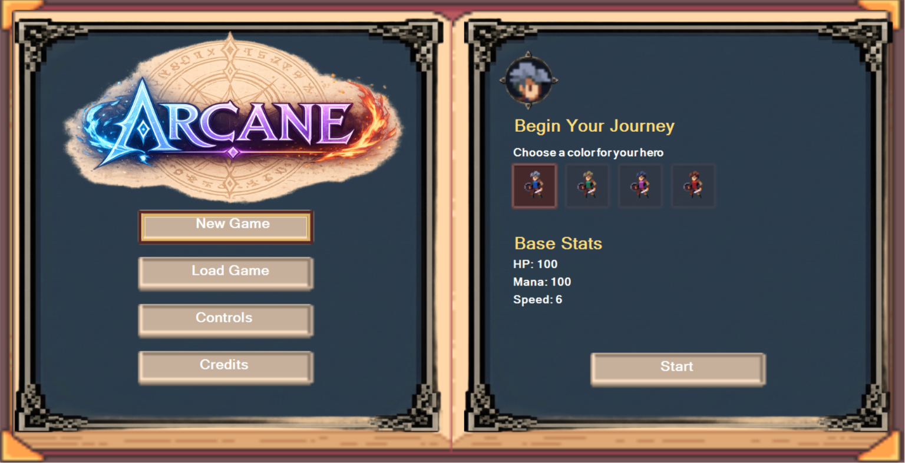

### Gameplay
| Shop | Inventory |
|------|-----------|
| 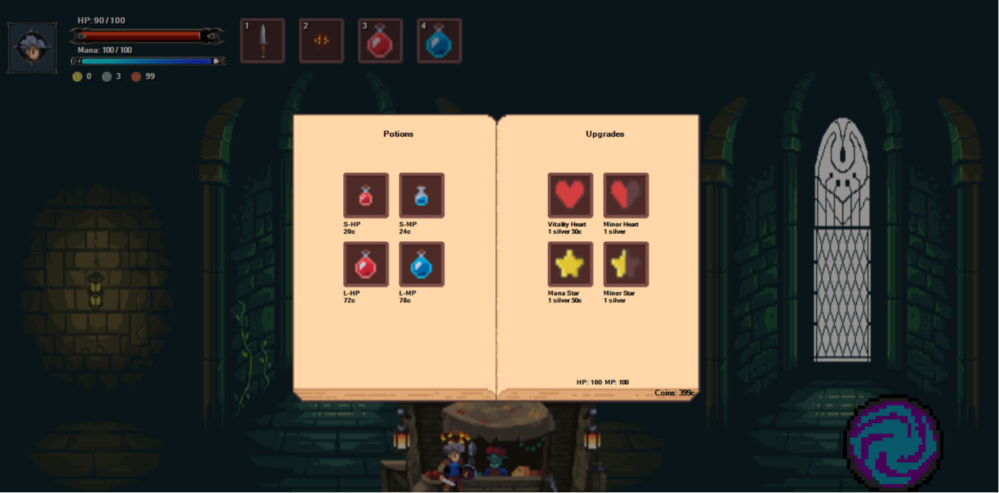 | 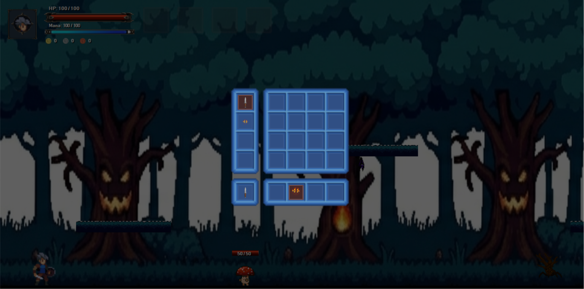 |

### Combat

| Magic | Laser Ability | Shield |
|--------|---------------|--------|
| 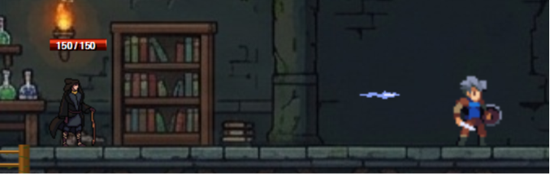 | 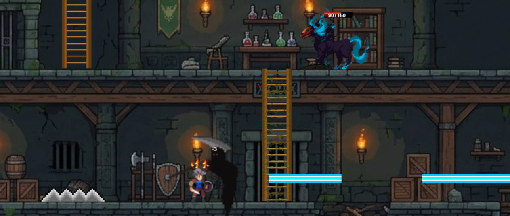 | 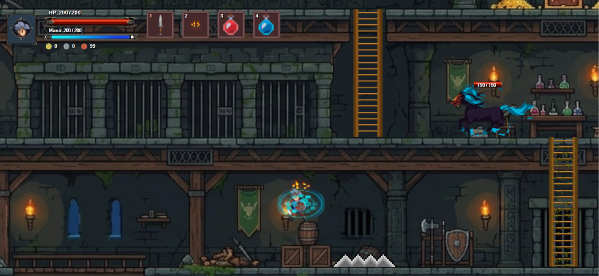 |

### Bosses

| Minotaur | Reaper Summons | Aegis |
|-----------|----------------|-------|
| 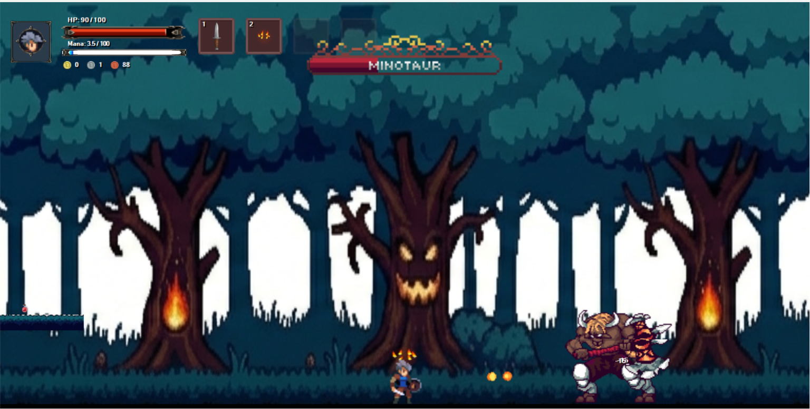 | 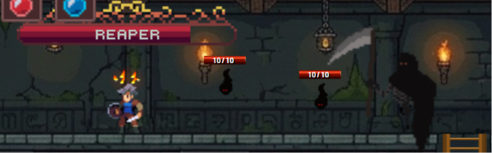 | 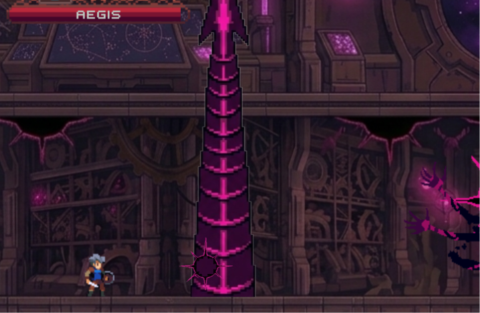 |

### World

| Portal | Healing |
|---------|---------|
| 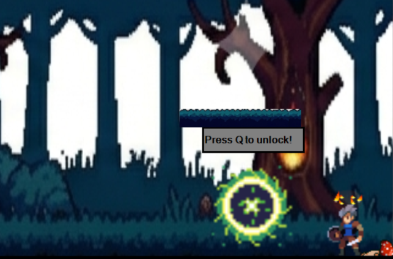 | 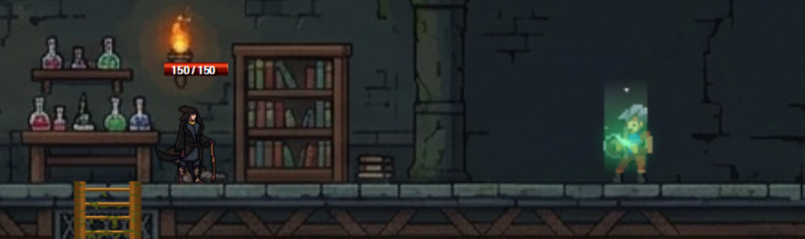 |

### Victory

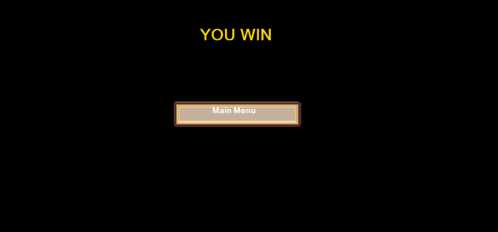

---

## Development Constraints

This project was developed according to the requirements and limitations defined by the Multimedia Programming course.

Due to course guidelines, the implementation followed specific restrictions, including:

- Keeping the entire project code within a single source file as required by the course criteria.
- Avoiding advanced C# language features and frameworks that were not introduced during the course.
- Implementing game systems manually without relying on external game engines or third-party libraries.
- Building all gameplay mechanics, UI components, animations, and interactions directly using C# and Windows Forms.
- Using only syntax that was taught during the lecture.
  
These constraints provided a deeper understanding of fundamental programming concepts, including event-driven programming, object-oriented principles, game logic design, multimedia handling, and user interface development.
---
# Features

## Combat System

- Real-time melee combat
- Multiple weapons
- Combo attacks
- Critical hit system
- Enemy knockback
- Boss battles
- Different enemy types

## Magic System

- Fireball spells
- Powerful laser ability
- Mana-based spell casting
- Mana regeneration
- Unlockable abilities

## RPG Elements

- Health and Mana system
- Inventory management
- Potion collection and usage
- Coin system
- Weapon switching
- Character progression

## Shop System

Players can spend collected coins to purchase:

- Potions
- Upgrades

---

## Inventory

The game includes a fully functional inventory system featuring:

- Item storage
- Potion management
- Quick slots
- Drag-and-drop interactions
- Weapon selection

---

## Enemy

Enemies include:

- Patrol behavior
- Attack states
- Chase mechanics
- Damage reactions
- Death animations

---

## Save System

The game supports persistent progress through:

- Manual save
- Automatic save
- Player data
- Enemy states
- Boss progress
- Inventory
- Current level

---

## User Interface

The game features a custom-built interface including:

- Health bar
- Mana bar
- Weapon slots
- Inventory menu
- Shop interface
- Coin display
- Main menu
- Victory screen

---

## Technologies Used

- C#
- .NET Framework
- Windows Forms
- Basic Object-Oriented Programming

---


## How to Run

1. Clone the repository.

```bash
git clone https://github.com/yourusername/your-repository.git
```

2. Open the solution in Visual Studio.

3. Build the project.

4. Run the application.

---

## Gameplay

Players explore different areas while defeating enemies, collecting coins, purchasing upgrades, unlocking powerful abilities, and progressing through increasingly challenging levels until defeating the final bosses.

Combat combines melee attacks with ranged magical abilities, encouraging players to balance health, mana, and inventory resources throughout the adventure.

---

## Authors

Developed as a Multimedia Programming course Project using C# Windows Forms by Kareem Ahmed and Mostafa Mohamemd Saaed.
